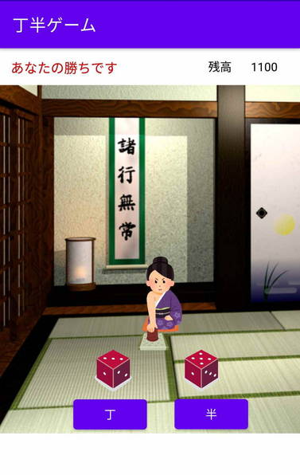

# DiceGameChoHan

## 概要
丁か半を選択するゲームです

## ゲームのルール
* 2つのサイコロの目の合計が「丁」（偶数）か「半」（奇数）になるかを予測します。
  * 予想した目の合計が、結果と一致した場合は、残高が+100点増えます
  * 逆に不一致の場合は、残高が-100点となります 
* プレイヤーの初期残高（クレジット）は、1000点です
  * 残高が2000点を超えた場合、プレイヤーの勝利となります
  * 残高が0点（もしくはそれ以下）となった場合、プレイヤーの負けとなります。
   
## その他情報
* ゲーム中、画面上の女性を長押しするとルールが表示されます

## スクリーンショット
